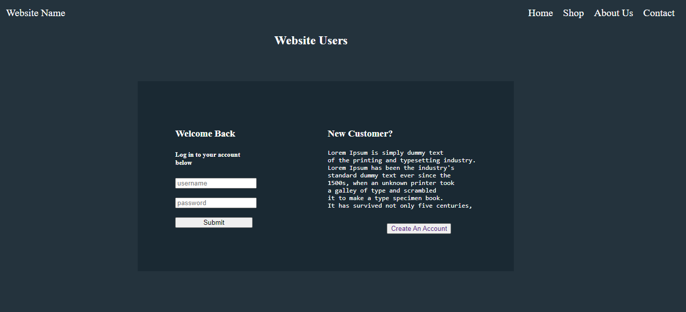

# Flask-login-app

> A clean & beautiful REST API Login App!

### Website Preview

 
    

## Features 
> Valid HTML5, CSS3 & Python code\
> Easy to modify\
> Uses Flask Server

## Sections 
✔️ Home \
✔️ Shop \
✔️ About Us \
✔️ Contact \
✔️ login \
✔️ Register \
✔️ Profile 

## Tools Used 
* [<b>Flask Bcrypt</b>](https://flask-bcrypt.readthedocs.io/en/latest/) - To encrypt passwords.
* [<b>Flask</b>](https://flask-doc.readthedocs.io/en/latest/) - To host the server.
* [<b>Flask-mysql-connector</b>](https://pypi.org/project/flask-mysql-connector/) - To save user data to a database.
* [<b>Flask-session</b>](https://pythonbasics.org/flask-sessions/) - To get the current user logged in.

## Learned subjects
-  How to join mysql tables
-  Encrypt/Hash passwords
-  Flask session
